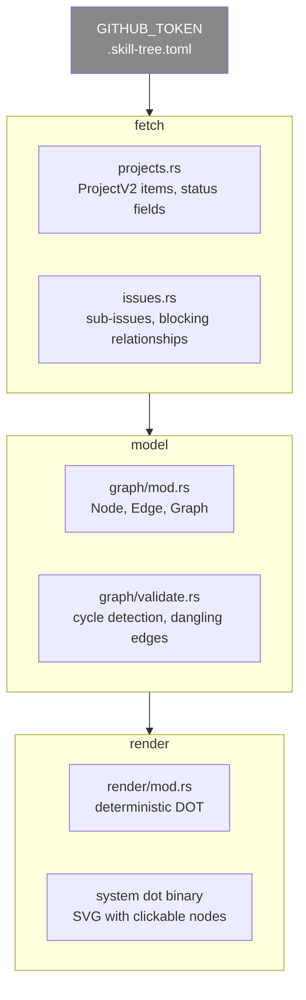
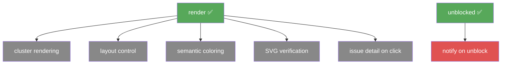

# Roadmap

## v1

v1 ships the complete fetch → model → render pipeline for a single GitHub
Project. The acceptance bar is a real project board rendered correctly with
no manual data entry.

### Scope

**Fetch.** Read all items from a GitHub Project V2 via the GraphQL API.
Extract the value of the status custom field for each issue. Follow
`hasNextPage` cursors until all items are fetched regardless of project size.

**Model.** Build a directed graph from the fetched data. One issue is one
node. One blocking relationship is one edge. Sub-issues become parent-child
relationships. Validate that no edge references a missing issue. Detect
cycles and report the exact path.

**Render.** Write a Graphviz DOT file. Optionally pipe it through the system
`dot` binary to produce an SVG. Node color is driven by the status field
value via the `[colors]` table in `.skill-tree.toml`. Every node in the SVG
is a URL to its GitHub issue. Output is deterministic across repeated runs.

### Subcommands

```
skill-tree render      render the graph as DOT or SVG
skill-tree unblocked   list open issues with no incoming blocking edges
skill-tree validate    check for cycles and dangling edges, produce no output
```

### Acceptance criteria

- `skill-tree render` produces valid DOT for a real GitHub Project board
- `skill-tree unblocked` returns issues with indegree zero and state OPEN
- Cycle detection names the full cycle path in the error message
- Pagination handles projects with more than 100 issues transparently
- Every error message identifies the specific file, field, or issue involved
- DOT output is byte-identical across repeated runs on the same data

### Pipeline



---

## Post v1

Each item below is a confirmed requirement deferred until v1 ships and
produces real usage data.



**Cluster rendering.** Sub-issues rendered as Graphviz clusters — a parent
issue box visually containing its children. Blocked by: v1 render.

**Layout control.** Support for multiple Graphviz layout engines (`dot`,
`neato`, `fdp`) and tunable layout attributes to reduce crossing edges.
Blocked by: v1 render with real usage data.

**Semantic coloring.** Color nodes by topic or theme in addition to status,
driven by GitHub labels. Blocked by: v1 render.

**SVG verification.** A command that fetches current GitHub state and
compares it against a previously rendered SVG, reporting drift.
Blocked by: v1 render and validate.

**Issue detail on click.** Clicking a node in the SVG opens an inline panel
showing title, status, assignee, and description.
Blocked by: v1 render.

**Notify on unblock.** A watch mode that polls GitHub and notifies when an
issue transitions from blocked to unblocked.
Blocked by: `skill-tree unblocked`.

---

## Non-goals

| Item | Decision |
|---|---|
| Issue body parsing | GitHub's native blocking relationship is the only edge source |
| Multiple edge types in v1 | One type: `blocks`. Design nodes handle richer relationships |
| PR nodes | Pull requests are not dependency nodes |
| Non-GitHub sources | GitLab, Jira, Linear, Azure DevOps out of scope |
| Interactive UI | Static SVG only. No web server, no JavaScript framework |
| GitHub App auth | `GITHUB_TOKEN` environment variable is sufficient for v1 |
| Local state persistence | Ephemeral in-memory graphs. No database, no cache |