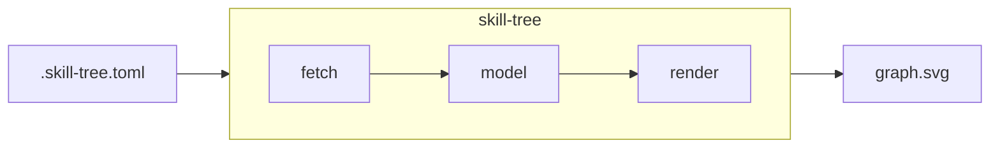
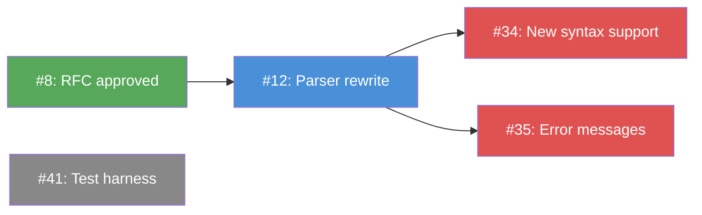

# skill-tree

skill-tree fetches a GitHub Project and renders it as a directed dependency graph.

Given a `.skill-tree.toml` pointing at a GitHub Project, skill-tree reads every
issue on the board, extracts blocking relationships and sub-issue hierarchy from
GitHub's native features, and produces a Graphviz DOT file or SVG where each
node is a GitHub issue and each edge is a blocking relationship.

```bash
skill-tree render --format svg --output graph.svg
skill-tree unblocked
skill-tree validate
```

- For installation, see [Installing skill-tree](./guide/install.md).
- For configuration, see [Configuration](./guide/configuration.md).
- For subcommand reference, see [Subcommands](./guide/subcommands.md).

## How it works



The pipeline has three stages. **Fetch** reads project items, status field
values, sub-issues, and blocking relationships from the GitHub GraphQL API.
**Model** builds a directed graph of nodes and edges and validates it for
cycles and dangling references. **Render** writes a deterministic DOT file
and optionally pipes it through the system `dot` binary to produce an SVG
with clickable nodes.

## What the output looks like



Node color is driven by the value of a single-select custom field in GitHub
Projects. Colors are configured in `.skill-tree.toml`. Every node in the SVG
links to its GitHub issue.